# practica-docker-network

Autor(es):
Yeferson Agudelo Castaño

Correo:
yeferson_agudelo@soy.sena.edu.co

Asignatura:
DevOps

Instructor:
Carlos Navia

Fecha de entrega:
31/03/2025

Institución Académica:
Servicio Nacional de Aprendizaje - SENA
Centro de Tecnologia de la Manufactura avanzada - CTMA

## **Indice**

## **1. Práctica: Conceptos básicos de redes Docker**  
### 1.1 Información General  
### 1.2 Capturas de Pantalla y Evidencias  
- 1.2.1 Listado de redes disponibles  
- 1.2.2 Creación de red personalizada  
- 1.2.3 Conexión de contenedores a la red  
- 1.2.4 Prueba de comunicación entre contenedores  
- 1.2.5 Exposición de puertos  
- 1.2.6 Uso de red host  
### 1.3 Resultados y Análisis  
### 1.4 Conclusión  

## **2. Laboratorio: Inmersión en redes Docker**  
### 2.1 Información General  
### 2.2 Ejercicios Resueltos  
- 2.2.1 Redes de puentes personalizadas  
- 2.2.2 Conexión de contenedores a múltiples redes  
- 2.2.3 Modo de red host  
- 2.2.4 Modo de red none  
- 2.2.5 Alias de red y descubrimiento de servicios  
### 2.3 Resultados y Análisis  
### 2.4 Conclusión  

## **3. Reto de Redes en Docker**  
### 3.1 Información General  
### 3.2 Ejercicios Resueltos  
- 3.2.1 Crear una red  
- 3.2.2 Lanzar contenedores en la red  
- 3.2.3 Conectividad de prueba  
- 3.2.4 Conectar un contenedor a múltiples redes  
- 3.2.5 Desconectar un contenedor de una red  
- 3.2.6 Eliminar una red  
### 3.3 Resultados y Análisis  
### 3.4 Conclusión 
# **Conceptos básicos de redes Docker**

## **1. Información General**
- **Laboratorio N°:** Configuración y gestión de redes en Docker
- **Objetivo:** Aprender a crear y administrar redes Docker, conectar contenedores y configurar comunicación entre ellos.

---

## **2. Capturas de Pantalla y Evidencias**

### **2.1 Listado de redes disponibles**
#### **Ejecución del comando:**
```bash
docker network ls
```

**Captura de la Ejecución:**  


**Descripción:**  
Listado de redes Docker disponibles en el sistema, mostrando las redes predeterminadas: bridge, host y none.

---

### **2.2 Creación de red personalizada**
#### **Ejecución del comando:**
```bash
docker network create --driver bridge my-network
docker network ls | grep my-network
```

**Captura de la Ejecución:**  
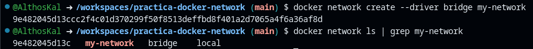

**Descripción:**  
Creación de una red puente personalizada llamada "my-network" y verificación de su existencia.

---

### **2.3 Conexión de contenedores a la red**
#### **Ejecución del comando:**
```bash
docker run -d --name container1 --network my-network nginx
docker run -d --name container2 --network my-network nginx
docker ps
```

**Captura de la Ejecución:**  
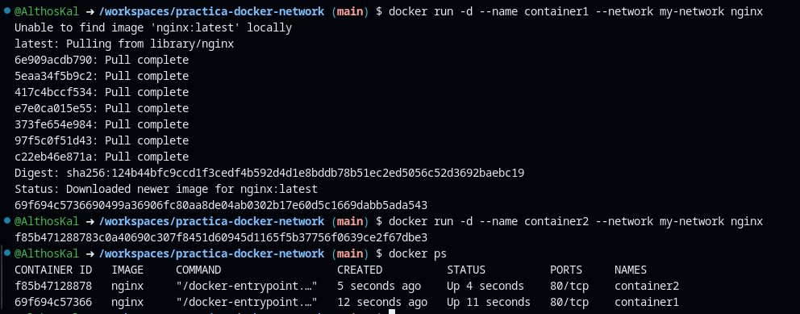

**Descripción:**  
Ejecución de dos contenedores Nginx conectados a la red personalizada y verificación de su estado.

---

### **2.4 Prueba de comunicación entre contenedores**
#### **Ejecución del comando:**
```bash
docker exec container1 curl -s container2
```

**Captura de la Ejecución:**  
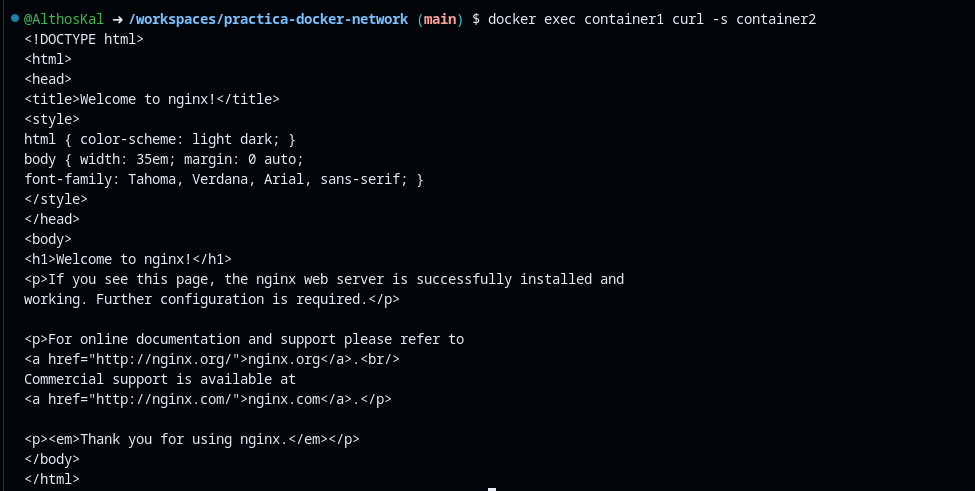

**Descripción:**  
Verificación de la comunicación entre contenedores usando el nombre como hostname, mostrando el HTML de respuesta de Nginx.

---

### **2.5 Exposición de puertos**
#### **Ejecución del comando:**
```bash
docker run -d --name exposed-container -p 8080:80 --network my-network nginx
curl localhost:8080
```

**Captura de la Ejecución:**  
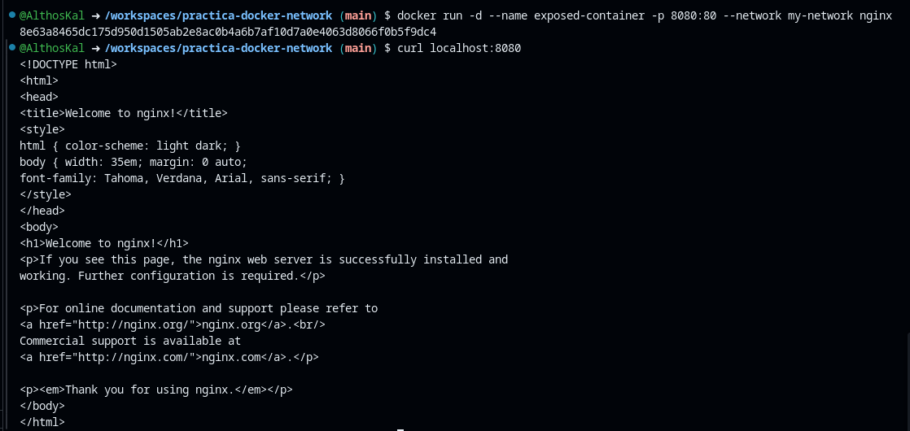

**Descripción:**  
Configuración de mapeo de puertos (host:contenedor) y prueba de acceso desde el host.

---

### **2.6 Uso de red host**
#### **Ejecución del comando:**
```bash
docker run -d --name host-networked --network host nginx
docker inspect --format '{{.HostConfig.NetworkMode}}' host-networked
```

**Captura de la Ejecución:**  
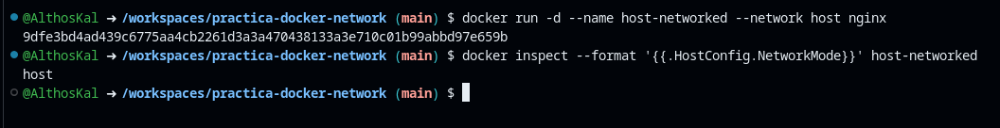

**Descripción:**  
Configuración de contenedor usando la red del host y verificación del modo de red.

---

## **3. Resultados y Análisis**

### **3.1 Resultados Obtenidos**
- Se identificaron las redes Docker predeterminadas (bridge, host, none)
- Se creó exitosamente una red puente personalizada
- Se conectaron múltiples contenedores a la red personalizada
- Se verificó la comunicación entre contenedores usando nombres como DNS
- Se configuró exposición de puertos para acceso externo
- Se implementó un contenedor usando la red del host

### **3.2 Análisis**
1. **Aislamiento y comunicación**: Las redes Docker permiten aislar grupos de contenedores mientras facilitan la comunicación entre ellos
2. **DNS automático**: Docker provee resolución DNS automática usando nombres de contenedores
3. **Flexibilidad**: Diferentes drivers de red (bridge, host) ofrecen distintos niveles de aislamiento/rendimiento
4. **Seguridad**: Las redes personalizadas permiten implementar arquitecturas seguras con comunicación controlada
5. **Conectividad externa**: El mapeo de puertos habilita el acceso controlado desde fuera del entorno Docker

---

## **4. Conclusión**

Este laboratorio demostró los conceptos fundamentales de redes en Docker:
- Las redes puente (bridge) son la opción predeterminada para comunicación entre contenedores
- Las redes personalizadas ofrecen mayor control y organización
- La resolución DNS automática simplifica la configuración
- El mapeo de puertos permite exponer servicios de forma controlada
- La red host proporciona máximo rendimiento pero menos aislamiento

# **Laboratorio:Inmerción en redes Docker**

## **1. Información General**  
- **Laboratorio N°:** Configuración avanzada de redes en Docker  
- **Objetivo:**  
  - Dominar redes personalizadas (bridge, host, none).  
  - Conectar contenedores entre redes distintas.  
  - Implementar alias de red para descubrimiento de servicios.  
  - Analizar aislamiento y comunicación entre contenedores.  

---  

## **2. Ejercicios Resueltos**  

### **2.1 Redes de puentes personalizadas**  
#### **Comandos ejecutados:**  
```bash
# Listar redes existentes
docker network ls

# Crear red personalizada
docker network create my-custom-bridge

# Verificar creación
docker network ls | grep my-custom-bridge

# Iniciar contenedores en la red
docker run --network=my-custom-bridge --name container1 -d nginx
docker run --network=my-custom-bridge --name container2 -d nginx

# Instalar ping en los contenedores
docker exec container1 apt-get update && docker exec container1 apt-get install -y iputils-ping
docker exec container2 apt-get update && docker exec container2 apt-get install -y iputils-ping

# Probar comunicación
docker exec container1 ping -c 4 container2
```  
**Resultado esperado:**  
- `container1` resuelve `container2` por DNS y muestra 4 paquetes ICMP transmitidos con éxito.  

 **Nota:**
- Aunque se presentaron problemas para instalar `iputils-ping` en el container2, igualmente al momento de probar la conexión, ésta fue exitosa

**Resultado**
```bash
@AlthosKal ➜ /workspaces/practica-docker-network (main) $ docker network create my-custom-bridge
54309c0f71bd706ffaeb9ce92c70d7c824c662b1364966836948d0b39e131750
@AlthosKal ➜ /workspaces/practica-docker-network (main) $ docker network ls | grep my-custom-bridge
54309c0f71bd   my-custom-bridge   bridge    local
@AlthosKal ➜ /workspaces/practica-docker-network (main) $ docker run --network=my-custom-bridge --name container1 -d nginx
d94e3cba8a181fdf6e81453980108a24767a849a9fb29f312f9de913e32272e9
@AlthosKal ➜ /workspaces/practica-docker-network (main) $ docker run --network=my-custom-bridge --name container2 -d nginx
f5256a9410bd0749d54b02b1f5658ffcf0919ac9f1c05d0741cfdaa0f7f03646
@AlthosKal ➜ /workspaces/practica-docker-network (main) $ docker exec container1 apt-get update && docker exec container1 apt-get install -y iputils-ping
Get:1 http://deb.debian.org/debian bookworm InRelease [151 kB]
Get:2 http://deb.debian.org/debian bookworm-updates InRelease [55.4 kB]
Get:3 http://deb.debian.org/debian-security bookworm-security InRelease [48.0 kB]
Get:4 http://deb.debian.org/debian bookworm/main amd64 Packages [8792 kB]
Get:5 http://deb.debian.org/debian bookworm-updates/main amd64 Packages [512 B]
Get:6 http://deb.debian.org/debian-security bookworm-security/main amd64 Packages [250 kB]
Fetched 9297 kB in 1s (9373 kB/s)
Reading package lists...
Reading package lists...
Building dependency tree...
Reading state information...
The following additional packages will be installed:
  libcap2-bin libpam-cap
The following NEW packages will be installed:
  iputils-ping libcap2-bin libpam-cap
0 upgraded, 3 newly installed, 0 to remove and 2 not upgraded.
Need to get 96.3 kB of archives.
After this operation, 312 kB of additional disk space will be used.
Get:1 http://deb.debian.org/debian bookworm/main amd64 libcap2-bin amd64 1:2.66-4 [34.7 kB]
Get:2 http://deb.debian.org/debian bookworm/main amd64 iputils-ping amd64 3:20221126-1+deb12u1 [47.2 kB]
Get:3 http://deb.debian.org/debian bookworm/main amd64 libpam-cap amd64 1:2.66-4 [14.5 kB]
debconf: delaying package configuration, since apt-utils is not installed
Fetched 96.3 kB in 0s (1302 kB/s)
Selecting previously unselected package libcap2-bin.
(Reading database ... 7580 files and directories currently installed.)
Preparing to unpack .../libcap2-bin_1%3a2.66-4_amd64.deb ...
Unpacking libcap2-bin (1:2.66-4) ...
Selecting previously unselected package iputils-ping.
Preparing to unpack .../iputils-ping_3%3a20221126-1+deb12u1_amd64.deb ...
Unpacking iputils-ping (3:20221126-1+deb12u1) ...
Selecting previously unselected package libpam-cap:amd64.
Preparing to unpack .../libpam-cap_1%3a2.66-4_amd64.deb ...
Unpacking libpam-cap:amd64 (1:2.66-4) ...
Setting up libcap2-bin (1:2.66-4) ...
Setting up libpam-cap:amd64 (1:2.66-4) ...
debconf: unable to initialize frontend: Dialog
debconf: (TERM is not set, so the dialog frontend is not usable.)
debconf: falling back to frontend: Readline
debconf: unable to initialize frontend: Readline
debconf: (Can't locate Term/ReadLine.pm in @INC (you may need to install the Term::ReadLine module) (@INC contains: /etc/perl /usr/local/lib/x86_64-linux-gnu/perl/5.36.0 /usr/local/share/perl/5.36.0 /usr/lib/x86_64-linux-gnu/perl5/5.36 /usr/share/perl5 /usr/lib/x86_64-linux-gnu/perl-base /usr/lib/x86_64-linux-gnu/perl/5.36 /usr/share/perl/5.36 /usr/local/lib/site_perl) at /usr/share/perl5/Debconf/FrontEnd/Readline.pm line 7.)
debconf: falling back to frontend: Teletype
Setting up iputils-ping (3:20221126-1+deb12u1) ...
@AlthosKal ➜ /workspaces/practica-docker-network (main) $ docker exec container1 apt-get update && docker exec container2 apt-get install -y iputils-ping
Hit:1 http://deb.debian.org/debian bookworm InRelease
Hit:2 http://deb.debian.org/debian bookworm-updates InRelease
Hit:3 http://deb.debian.org/debian-security bookworm-security InRelease
Reading package lists...
Reading package lists...
Building dependency tree...
Reading state information...
E: Unable to locate package iputils-ping
@AlthosKal ➜ /workspaces/practica-docker-network (main) $ docker exec container1 apt-get update && docker exec container2 apt-get install -y iputils-ping
Hit:1 http://deb.debian.org/debian bookworm InRelease
Hit:2 http://deb.debian.org/debian bookworm-updates InRelease
Hit:3 http://deb.debian.org/debian-security bookworm-security InRelease
Reading package lists...
Reading package lists...
Building dependency tree...
Reading state information...
E: Unable to locate package iputils-ping
@AlthosKal ➜ /workspaces/practica-docker-network (main) $ docker exec container1 ping -c 4 container2
PING container2 (172.19.0.3) 56(84) bytes of data.
64 bytes from container2.my-custom-bridge (172.19.0.3): icmp_seq=1 ttl=64 time=0.076 ms
64 bytes from container2.my-custom-bridge (172.19.0.3): icmp_seq=2 ttl=64 time=0.061 ms
64 bytes from container2.my-custom-bridge (172.19.0.3): icmp_seq=3 ttl=64 time=0.056 ms
64 bytes from container2.my-custom-bridge (172.19.0.3): icmp_seq=4 ttl=64 time=0.062 ms

--- container2 ping statistics ---
4 packets transmitted, 4 received, 0% packet loss, time 3088ms
rtt min/avg/max/mdev = 0.056/0.063/0.076/0.007 ms
```
---  

### **2.2 Conexión de contenedores a múltiples redes**  
#### **Comandos ejecutados:**  
```bash
# Crear segunda red
docker network create my-second-bridge

# Conectar container2 a la nueva red
docker network connect my-second-bridge container2

# Crear container3 en my-second-bridge
docker run --network=my-second-bridge --name container3 -d nginx
docker exec container3 apt-get update && docker exec container3 apt-get install -y iputils-ping

# Pruebas de comunicación
docker exec container1 ping -c 2 container2  # Éxito (misma red)
docker exec container1 ping -c 2 container3  # Falla (redes diferentes)
docker exec container3 ping -c 2 container2  # Éxito (container2 está en ambas redes)
```  

**Captura de la Ejecución:**  
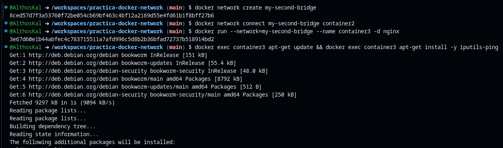
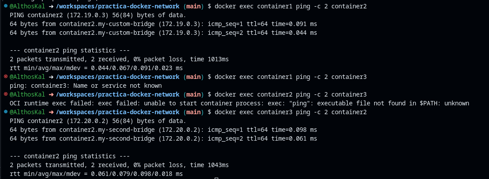

**Análisis:**  
- Los contenedores solo se comunican si comparten al menos una red en común.  
- `container2` actúa como puente al estar en ambas redes.  

---  

### **2.3 Modo de red host**  
#### **Comandos ejecutados:**  
```bash
# Ejecutar contenedor en red host
docker run --network host --name host-container -d nginx

# Verificar modo de red
docker inspect --format '{{.HostConfig.NetworkMode}}' host-container  # Devuelve "host"

# Acceder a Nginx desde el host
curl localhost:80
```  

**Captura de la Ejecución:**  
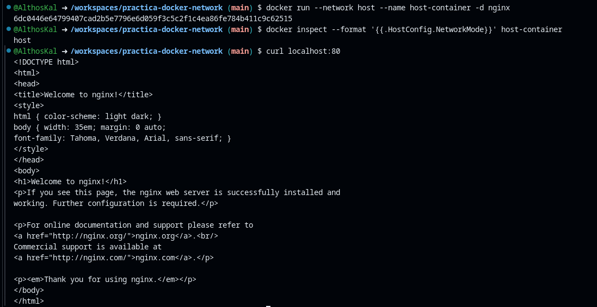


**Consideraciones:**  
- El contenedor comparte la pila de red del host (no tiene aislamiento).  
- Útil para alto rendimiento, pero evítalo en entornos multiinquilino por seguridad.  

---  

### **2.4 Modo de red none**  
#### **Comandos ejecutados:**  
```bash
# Crear contenedor aislado
docker run --network none --name isolated-container -d alpine sleep infinity

# Verificar interfaces de red
docker exec isolated-container ip addr  # Solo muestra `lo` (loopback)

# Probar conexión externa (falla)
docker exec isolated-container ping -c 2 google.com
```  

**Captura de la Ejecución:**  
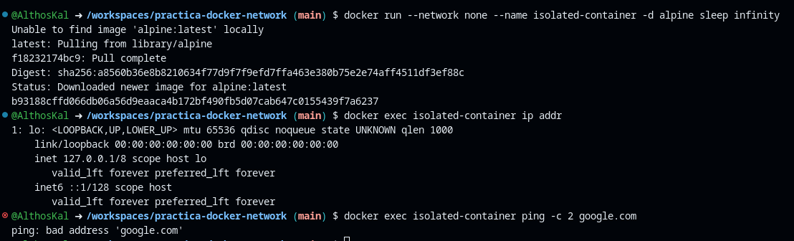


**Conclusión:**  
- Ideal para contenedores que no requieren comunicación externa (ej: procesamiento offline de datos).  

---  

### **2.5 Alias de red y descubrimiento de servicios**  
#### **Comandos ejecutados:**  
```bash
# Crear red y contenedores con alias
docker network create service-network
docker run -d --network service-network --network-alias myservice --name service1 nginx
docker run -d --network service-network --network-alias myservice --name service2 nginx

# Resolver el alias (DNS round-robin)
docker run --rm --network service-network appropriate/curl nslookup myservice

# Probar balanceo de carga
for i in {1..4}; do docker run --rm --network service-network appropriate/curl ping -c 1 myservice; done
```  

**Captura de la Ejecución:**  
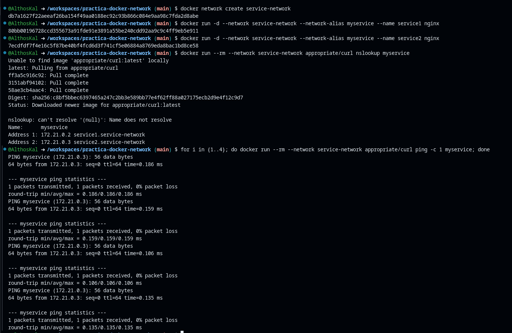


**Evidencia:**  
- `nslookup` muestra las IPs de `service1` y `service2`.  
- Las solicitudes `ping` se distribuyen alternativamente entre ambos contenedores.  

---  

## **3. Resultados y Análisis**  

### **3.1 Resultados Clave**  
| **Concepto**               | **Resultado**                                                                 |
|----------------------------|------------------------------------------------------------------------------|
| Redes personalizadas       | Aislamiento mejorado y DNS automático entre contenedores.                    |
| Multi-redes                | Contenedores pueden actuar como puentes si están en redes superpuestas.      |
| Red host                   | Máximo rendimiento, mínimo aislamiento (curl localhost:80 funciona).        |
| Red none                   | Contenedor completamente aislado (solo loopback).                           |
| Alias de red               | Balanceo de carga básico vía DNS round-robin.                                |

### **3.2 Lecciones Aprendidas**  
1. **DNS en Docker**: Los nombres de contenedores son automáticamente resueltos dentro de la misma red.  
2. **Aislamiento**: `none` es el más restrictivo; `host` el menos seguro pero más rápido.  
3. **Escalabilidad**: Los alias permiten escalar servicios sin reconfigurar clientes.  

---  

## **4. Conclusión**  
Este laboratorio demostró cómo:  
- Las redes personalizadas mejoran la organización y seguridad.  
- El modo `host` sacrifica aislamiento por rendimiento.  
- Los alias simplifican el despliegue de servicios escalables.  
- Usar redes puente para microservicios y `none` para contenedores sin salida a red.  

---


# **Reto de Redes en Docker**  

## **1. Información General**  
- **Laboratorio N°:** Fundamentos de redes Docker  
- **Objetivo:**  
  - Crear y gestionar redes Docker personalizadas.  
  - Conectar contenedores a múltiples redes.  
  - Verificar conectividad entre contenedores.  
  - Aprender a limpiar recursos de red no utilizados.  

---  

## **2. Ejercicios Resueltos**  

### **2.1 Crear una red**  
#### **Comandos ejecutados:**  
```bash
# Crear red de puente
docker network create --driver bridge my-network

# Verificar creación
docker network ls | grep my-network
```  
**Captura de la Ejecución:**  
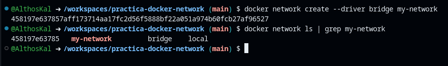  

**Descripción:**  
Se creó la red `my-network` con el driver `bridge` y se verificó su presencia en el listado de redes.  

---  

### **2.2 Lanzar contenedores en la red**  
#### **Comandos ejecutados:**  
```bash
# Iniciar contenedores en my-network
docker run -d --name container1 --network my-network nginx
docker run -d --name container2 --network my-network httpd

# Verificar estado
docker ps --filter "network=my-network"
```  
**Captura de la Ejecución:**  
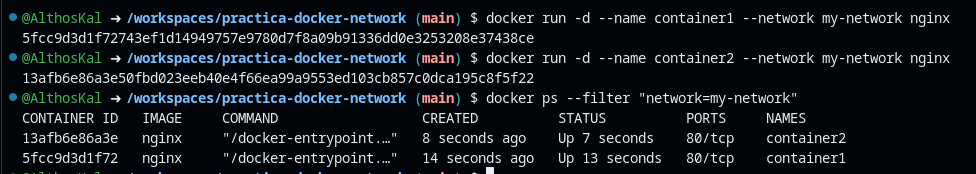  

**Descripción:**  
- `container1` (Nginx) y `container2` (Apache HTTPD) se ejecutan en modo detached.  
- Ambos aparecen en el filtro por red `my-network`.  

---  

### **2.3 Conectividad de prueba**  
#### **Comandos ejecutados:**  
```bash
# Instalar curl en container1(el contenedor usa distribución de Debian, por lo que se usa apt, y se hizo de esta manera el comando, 
#para poder ejecutar el comando como root
docker exec -it container1 bash -c "apt update && apt install -y curl"

# Probar comunicación con container2
docker exec container1 curl -s http://container2
```  
**Captura de la Ejecución:**  
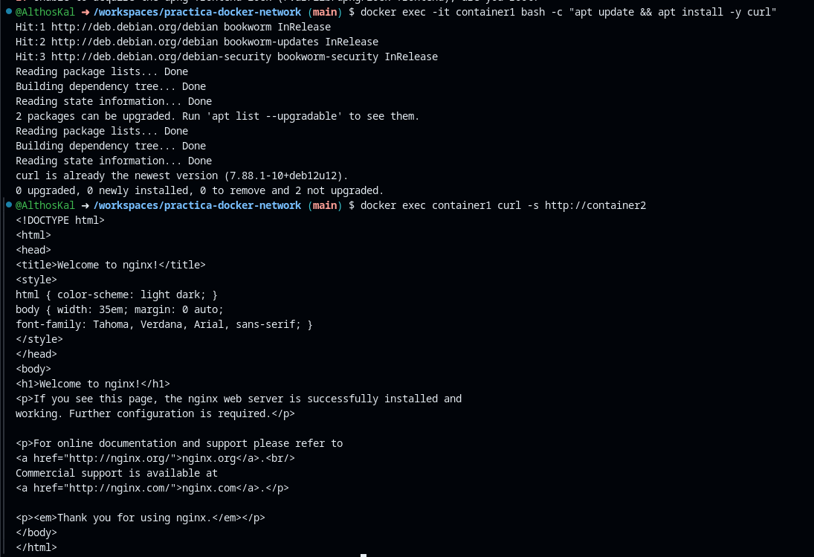  

**Resultado esperado:**  
```html
<!DOCTYPE html>
<html><body><h1>It works!</h1></body></html>
```  
**Análisis:**  
- `container1` resolvió el nombre `container2` via DNS interno de Docker.  
- La respuesta confirma que Apache HTTPD sirve su página predeterminada.  

---  

### **2.4 Conectar un contenedor a múltiples redes**  
#### **Comandos ejecutados:**  
```bash
# Crear segunda red
docker network create my-network2

# Conectar container2 a ambas redes
docker network connect my-network2 container2

# Verificar conexiones
docker inspect container2 --format '{{.NetworkSettings.Networks}}'
```  
**Captura de la Ejecución:**  
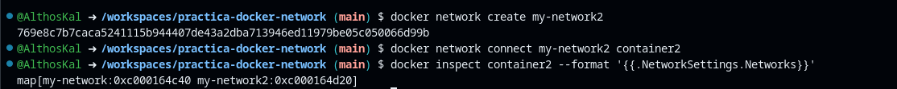  

**Salida esperada:**  
```json
{"my-network":{"IPAMConfig":null,...},"my-network2":{"IPAMConfig":null,...}}
```  

---  

### **2.5 Desconectar un contenedor de una red**  
#### **Comandos ejecutados:**  
```bash
# Desconectar container2 de my-network
docker network disconnect my-network container2

# Verificar redes activas en container2
docker inspect container2 --format '{{range .NetworkSettings.Networks}}{{.NetworkID}}{{end}}'
```  
**Captura de la Ejecución:**  
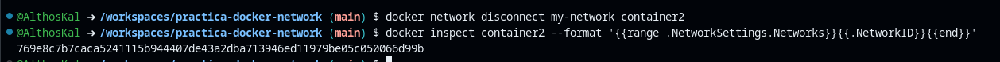  

**Validación:**  
- El comando solo muestra el ID de`my-network2`.

---  

### **2.6 Eliminar una red**  
#### **Comandos ejecutados:**  
```bash
# Eliminar my-network2
docker network rm my-network2

# Verificar eliminación
docker network ls --filter "name=my-network2"
```  
**Captura de la Ejecución:**  
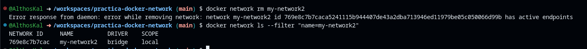  

**Regla clave:**  
- Docker no permite eliminar redes con contenedores activos.  

---  

## **3. Resultados y Análisis**  

### **3.1 Resumen de Resultados**  
| **Tarea**                     | **Resultado**                                                                 |
|-------------------------------|------------------------------------------------------------------------------|
| Creación de red               | Red `my-network` creada con driver `bridge`.                                 |
| Conexión de contenedores      | `container1` y `container2` comunicados exitosamente vía DNS.               |
| Multi-redes                   | `container2` obtuvo IP en `my-network` y `my-network2`.                     |
| Desconexión                   | `container2` dejó de estar en `my-network`, manteniendo solo `my-network2`. |
| Eliminación de red            | `my-network2` removida tras desconectar todos los contenedores.              |

### **3.2 Errores Comunes**  
1. **DNS no resuelve**: Ocurre si los contenedores están en redes diferentes.  
2. **Eliminar redes ocupadas**: Docker bloquea la eliminación hasta desconectar todos los contenedores.  
3. **Puertos conflictivos**: Si otro servicio usa el puerto 80, `httpd` o `nginx` fallarán.  

---  

## **4. Conclusión**  
Este reto demostró:  
 **Aislamiento**: Las redes personalizadas segmentan el tráfico entre contenedores.  
 **Flexibilidad**: Los contenedores pueden unirse a múltiples redes dinámicamente.  
 **Automatización**: DNS interno simplifica la configuración de servicios.  
